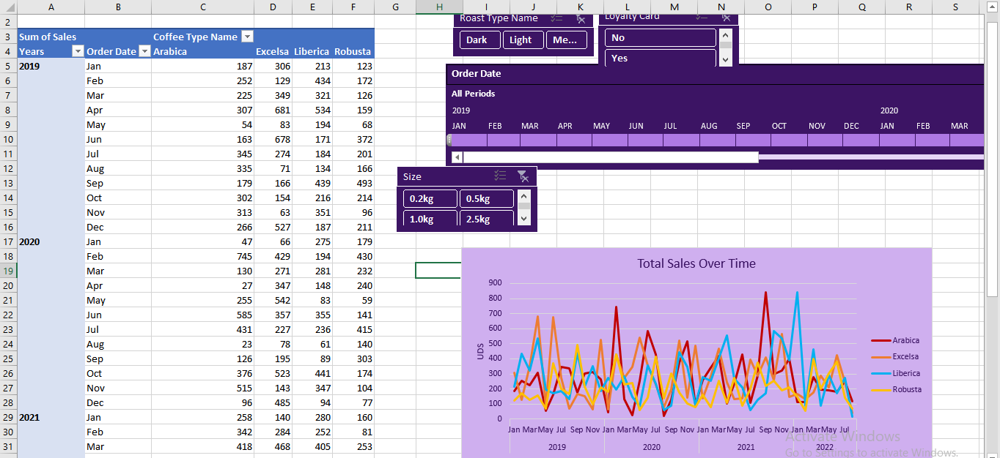

# Coffee Sales Dashboard (Excel Project)
This project demonstrates an end-to-end data analysis of global coffee sales using Microsoft Excel. The dataset spans multiple tables such as orders, customers, and products. I created an interactive dashboard that enables dynamic exploration of key sales insights.

 ## Key Steps & Features:

### Data Preparation & Transformation:

Created a Total Sales column by multiplying unit price and quantity.

Added readable Roast Type Name (e.g., Medium, Light, Dark) using Excel’s logical functions.

Mapped short coffee type codes (e.g., "Rob") to full names (e.g., "Robusta") using formulas.

Used VLOOKUP to bring in loyalty card information from the customer table.

### Data Modeling & Relationships:

Combined multiple tables (orders, customers, products) to create a unified dataset for analysis.

### Analysis & Dashboarding:

Built pivot tables to analyze total sales by coffee type, country, and time.

Visualized sales trends over time using a line graph with multiple lines for different coffee types.

Designed an interactive dashboard using slicers for roast type, coffee size, loyalty card status, and timeline filtering.

### Visual Elements:
Bar charts, line graphs, donut charts, slicers, and timeline filters for user-driven insights.

## Tools Used: 
Microsoft Excel, Pivot Tables, VLOOKUP, IF Formulas, Line & Bar Charts, Slicers, Hyperlinked Navigation
## Sheets Included: 
orders, customers, products, SalesByCountry, TotalSales, Dashboard, and more.
# File preview

